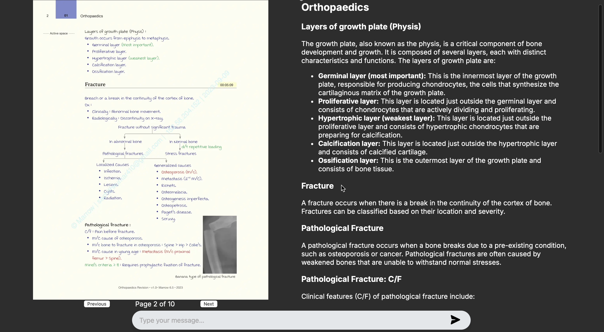
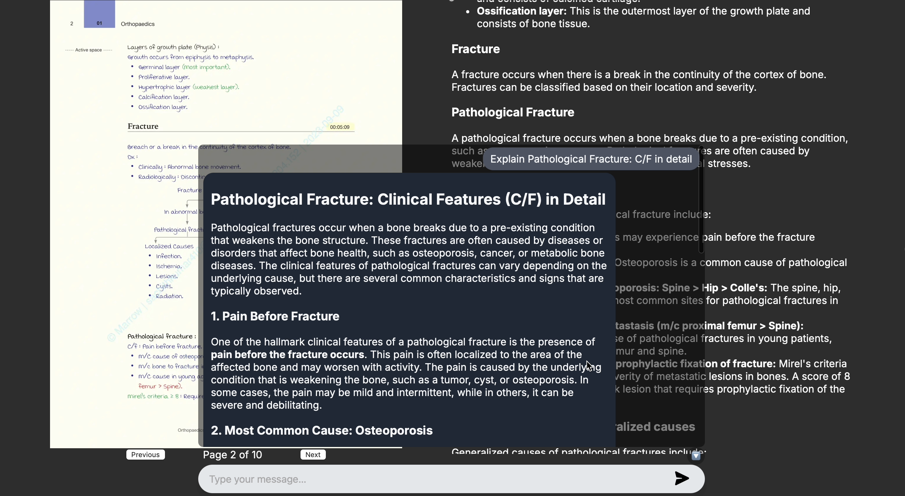

<div align="center">
  <h1>🚀 PagePilot</h1>
  <h3>The AI copilot for all your documents — powered by multimodal GenAI</h3>
  <p>
    <strong>Summarize, search, and chat with any PDF</strong><br />
    Transform dense documents into clear, interactive insights.
  </p>
</div>

---

## 🌟 Overview

**PagePilot** is a powerful GenAI companion designed to help individuals and teams navigate complex PDFs and documents effortlessly.

Built using **Next.js (frontend)** and **FastAPI (backend)**, PagePilot leverages **Together AI’s vision models** and **LLM Q\&A** to deliver:

* 📄 **Page-wise rendering** of documents
* 🧠 **Detailed summaries** using multimodal AI
* 💬 **Interactive chat** per page, trained on AI-generated summaries
* ✨ A modern, minimal, and dark-themed UI optimized for focus

---

## 💼 Enterprise Use Cases

| Department   | Example Use Case                              |
| ------------ | --------------------------------------------- |
| ✅ HR         | "What is the new maternity leave policy?"     |
| ✅ Legal      | "Show me the termination clause in this NDA." |
| ✅ Compliance | "Summarize the latest ISO guidelines."        |
| ✅ Support    | "What’s the reset procedure for product X?"   |
| ✅ Finance    | "Where are the Q2 performance highlights?"    |

---

## 🖼️ App Previews

### 🔍 Document Viewer with AI Summary Panel

<p align="center">
  
</p>

### 💬 Floating Chat Interface for Page-level Queries

<p align="center">
  
</p>

---

## 🎥 Demo Video

> 📽️ Click the image below to watch the full walkthrough

[](./media/DemoVideo.mp4)

---


## 🧑‍💻 Tech Stack

| Layer     | Technology                                            |
| --------- | ------------------------------------------------------|
| Frontend  | Next.js, Tailwind CSS                                 |
| Backend   | FastAPI, Uvicorn                                      |
| AI Models | Llama 3.2 11B + DeepSeek R1 Distilled Llama 70B       |
| PDF Tools | PIL (for rendering), image preprocessing              |
| Hosting   | Local                                                 |

---

## ⚙️ Getting Started

### 🔌 Backend (FastAPI)

```bash
cd backend
python3 -m venv venv
source venv/bin/activate
pip install -r ../requirements.txt
uvicorn backend.main:app --reload --port 8000
```

### 💻 Frontend (Next.js + Tailwind CSS)

```bash
cd frontend
npm install
npm run dev
```

Visit: [http://localhost:3001/learn](http://localhost:3001/learn)

---

## 🛠️ Environment Variables

Rename `.env.example` to `.env` in both `frontend/` and `backend/`.

### `frontend/.env`

```env
NEXT_PUBLIC_API_BASE_URL=http://localhost:8000
```

### `backend/.env`

```env
TOGETHER_API_KEY=your-together-ai-key
```

---

## 📁 Project Structure

```
PagePilot/
├── backend/         # FastAPI app
├── frontend/        # Next.js UI
├── media/           # Screenshots & demo video
├── requirements.txt
├── README.md
└── .gitignore
```

---

## ✨ Highlights

* ✅ Fully local GenAI setup (no external DB needed)
* ✅ AI-powered multimodal summarization
* ✅ Clean UI with collapsible summaries and floating chat
* ✅ Works with scanned handwritten notes, tables, and diagrams
* ✅ Ideal for developers, enterprise teams, and knowledge workers

---

## 🧠 Future Roadmap

* User Authentication & Document Library
* Save & Resume Q\&A Sessions per document
* Multi-page Summaries & Cross-Page Search

---

## 🤝 Contributing

We welcome PRs and feedback! Please open an issue for suggestions or feature requests.

---

## 📄 License

This project is licensed under the MIT License. See [LICENSE](LICENSE) for details.

---

<div align="center">
  Built with ❤️ by Kovarthan • Powered by Gen AI • Designed for real-world document intelligence
</div>
